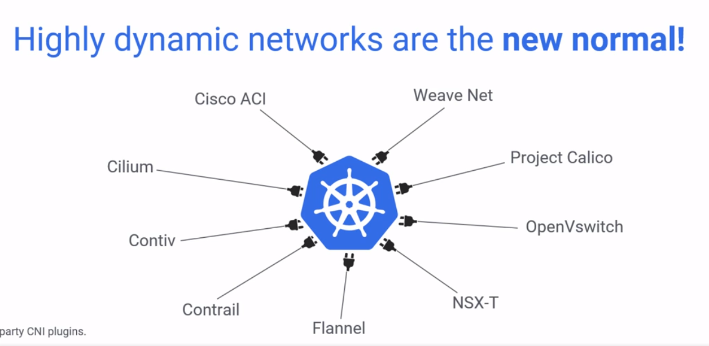

Kubernetes API je celkem komplexní nástroj a vše se točí kolem API, pojďme ho prozkoumat přez CURL a servisní RBAC účet.

## cURLing the Kubernetes API server
explore API

### Create a ServiceAccount, ClusterRole and RoleBinding
```bash
kubectl create serviceaccount api-explorer
```
```yaml
kind: ClusterRole
apiVersion: rbac.authorization.k8s.io/v1beta1
metadata:
  name: log-reader
rules:
- apiGroups: [""] # "" indicates the core API group
  resources: ["pods", "pods/log"]
  verbs: ["get", "watch", "list"]
```

```bash
kubectl create rolebinding api-explorer:log-reader --clusterrole log-reader --serviceaccount default:api-explorer
```
Get the Bearer Token, Certificate and API Server URL (dont forget to install **jq** for json parsing)
```bash
SERVICE_ACCOUNT=api-explorer
# Get the ServiceAccount's token Secret's name
SECRET=$(kubectl get serviceaccount ${SERVICE_ACCOUNT} -o json | jq -Mr '.secrets[].name | select(contains("token"))')
# Extract the Bearer token from the Secret and decode
TOKEN=$(kubectl get secret ${SECRET} -o json | jq -Mr '.data.token' | base64 -d)
# Extract, decode and write the ca.crt to a temporary location
kubectl get secret ${SECRET} -o json | jq -Mr '.data["ca.crt"]' | base64 -d > /tmp/ca.crt
# Get the API Server location
APISERVER=https://$(kubectl -n default get endpoints kubernetes --no-headers | awk '{ print $2 }')
```
```bash
kubectl get endpoints | grep kubernetes
curl -s $APISERVER/openapi/v2  --header "Authorization: Bearer $TOKEN" --cacert /tmp/ca.crt | less
curl -s $APISERVER/api/v1/namespaces/default/pods/ --header "Authorization: Bearer $TOKEN" --cacert /tmp/ca.crt | jq -rM '.items[].metadata.name'
curl -s $APISERVER/api/v1/namespaces/default/pods/nginx-5dc7fbd98-hvv6s/log  --header "Authorization: Bearer $TOKEN" --cacert /tmp/ca.crt
curl -s $APISERVER/swaggerapi --header "Authorization: Bearer $TOKEN" --cacert /tmp/ca.crt

kubectl api-versions
kubectl get --raw /apis/custom-metrics.metrics.k8s.io/v1beta1
bububu
```

