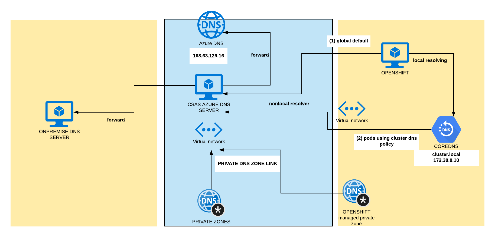

## DNS operator in Openshift
In Openshift 4, the DNS Operator deploys and manages CoreDNS to provide a name resolution service to pods, enabling DNS-based Kubernetes Service discovery in OpenShift.
The DNS Operator implements the dns API from the operator.openshift.io API group. The operator deploys CoreDNS using a DaemonSet, creates a Service for the DaemonSet, and configures the kubelet to instruct pods to use the CoreDNS Service IP for name resolution.
```sh
 # get dns clusteroperator
oc describe clusteroperators/dns
```
```sh
# get operator configuration
oc get dnses.operator.openshift.io/default -o yaml

  apiVersion: operator.openshift.io/v1
  kind: DNS
  spec: {}
  status:
    clusterDomain: cluster.local
    clusterIP: 172.30.0.10
```
spec is empty here, we will put some records later
```sh
 # get dns configuration
 # keep in mind we are using public instalation(publicZone)
oc get dns.config.openshift.io/cluster -o yaml

  apiVersion: config.openshift.io/v1
  kind: DNS
  spec:
    baseDomain: toshi44.csas.elostech.cz
    privateZone:
      id: /subscriptions/7504de90-f639-4328-a5b6-fde85e0a7fd9/resourceGroups/toshi44-dkxzr-rg/providers/Microsoft.Network/privateDnsZones/toshi44.csas.elostech.cz
    # for Internal installation this part is empty
    publicZone:
      id: /subscriptions/7504de90-f639-4328-a5b6-fde85e0a7fd9/resourceGroups/ocp42-shared/providers/Microsoft.Network/dnszones/csas.elostech.cz
  status: {}
```
## CoreDNS in OpenShift
+ Every Pod is assigned a DNS name: pod-ip.namespace-name.pod.cluster.local (A/AAAA record)
+ Every Service is assigned a DNS name: svc-name.namespace-name.svc.cluster.local (SRV record)
+ CoreDNS as DaemonSet

```sh
 # rsh to one of CoreDNS pod
oc rsh -n openshift-dns dns-default-24fm8  bash

cat /etc/coredns/Corefile 
  .:5353 {
      errors
      health
      kubernetes cluster.local in-addr.arpa ip6.arpa {
          pods insecure
          upstream
          fallthrough in-addr.arpa ip6.arpa
      }
      prometheus :9153
      forward . /etc/resolv.conf {
          policy sequential
      }
      cache 30
      reload
  }
```
```sh
kubernetes cluster.local in-addr.arpa ip6.arpa {
```
this enables a plugin that configure CoreDNS will reply to DNS queries based od IP of the services and pods of Kubernetes. (cluster.local handle all queries in this zone and also reverse dns lookups - in-addr.arpa)

```sh
forward . /etc/resolv.conf {
          policy sequential
      }

cat /etc/resolv.conf 
  # smh4lkfvymeuzcx1vpi1e15wih is generated for each installation
  search smh4lkfvymeuzcx1vpi1e15wih.ax.internal.cloudapp.net
  nameserver 168.63.129.16
```

this enables forwarding plugin for non cluster domain of Kubernetes. By default it use **node's /etc/resolv.conf**.

or config map for configuration
```yaml
oc get configmap/dns-default -n openshift-dns -o yaml
```

## RESOLVING from POD
Related options are  
+ "Default": The Pod inherits the name resolution configuration from the node that the pods run on.  
Default case is 
```sh
  search smh4lkfvymeuzcx1vpi1e15wih.ax.internal.cloudapp.net
  nameserver 168.63.129.16
```
+ "ClusterFirst": Any DNS query that does not match the configured cluster domain suffix, is forwarded to the upstream nameserver inherited from the node. Cluster administrators may have extra stub-domain and upstream DNS servers configured. See related discussion for details on how DNS queries are handled in those cases.  
Default case is:
```sh
search {namespace}.svc.cluster.local svc.cluster.local cluster.local smh4lkfvymeuzcx1vpi1e15wih.ax.internal.cloudapp.net
nameserver 172.30.0.10
options ndots:5
```
If not specified **ClusterFirst** is used not **Default**.

**Because A or AAAA records are not created for Pod names, hostname is required for the Pod’s A or AAAA record to be created.** A Pod with no hostname but with subdomain will only create the A or AAAA record for the headless service (default-subdomain.my-namespace.svc.cluster-domain.example), pointing to the Pod’s IP address. Also, Pod needs to become ready in order to have a record unless publishNotReadyAddresses=True is set on the Service

list dnsPolicy for pods in cluster:
```sh
oc get pods --all-namespaces -o json|jq -r '.items[]|{name: .metadata.name,namespace: .metadata.namespace,dnsPolicy: .spec.dnsPolicy}'
```

## Configure DNS forwarding in DNS clusterOperator
In fact there are two separate options with almost same effect but different approach.

### Configuration for appPods using CoreDNS service (dnsPolicy: ClusterFirst)

Operator can be modified to forward to specific DNS for defined "zones".
This modification will allow application pods running inside the cluster to resolve names hosted on a private DNS server outside the cluster.
```sh
oc get dnses.operator.openshift.io/default -o yaml

  apiVersion: operator.openshift.io/v1
  kind: DNS
  spec: {}
  status:
    clusterDomain: cluster.local
    clusterIP: 172.30.0.10

 #can be modified to 
  apiVersion: operator.openshift.io/v1
  kind: DNS
  spec:
   servers:
   - forwardPlugin:
       upstreams:
       - 10.1.1.12
     name: zone-forward
     zones:
     - csas.cz
  status:
    clusterDomain: cluster.local
    clusterIP: 172.30.0.10
```

### Change default resolver for nodes 
In Azure default resolver for nodes is Azure DNS (nameserver 168.63.129.16), all requests not hitting "clusterDomain" in our case "cluster.local" are forwarded to.  
to modify this setting to use custom DNS server:
```yaml
apiVersion: machineconfiguration.openshift.io/v1
kind: MachineConfig
metadata:
  labels:
    machineconfiguration.openshift.io/role: worker
  name: 56-worker-resolver
spec:
  config:
    ignition:
      version: 2.2.0
    storage:
      files:
      - contents:
          source: |
            search smh4lkfvymeuzcx1vpi1e15wih.ax.internal.cloudapp.net
            nameserver 10.1.1.4
          verification: {}
        filesystem: root
        mode: 420
        path: /etc/resolv.conf
```

