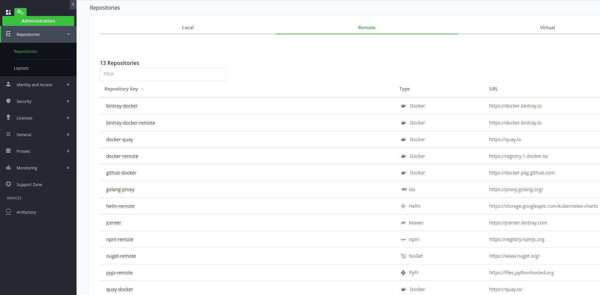

Pro instalaci a používání OCP v privátní síti bude jako zdroj všech kontejnerů využita Artifactory. Všechny remote repository (vnější) budou whitelistovány přez ní a bude pro ně vytvořena konfigurace.

## Artifactory fact
[Artifactory link](https://artifactory.csas.elostech.cz/ui/login/) -- adresa se může do budoucna lišit udávám jen z důvodu reference

repository: 
+ artifactory.csas.elostech.cz/docker-quay (remote repositoru directed to  **quay.io**)
+ artifactory.csas.elostech.cz/docker-quay-local (local repository for mirroring)

Na artifactory je potřeba konfiguraci typu remote repository vytvořit. Zatím nejsou standartizovány názvy. Obrázek níže je informativního charakteru.



## Použití "proxy repository" při instalaci OCP (QUAY.IO repository)
Upravíme konfigurační soubor install-config.yaml tak aby použil remote repository jako mirror a vytvořil tak CRD ImageContentSourcePolicy.  
**Trusted TLS cert must be used for docker registry, there is no option to use insecure container repo during install.**

### CREATE PULL SECRET FILE for install-config.yaml
Now we will create pull secret against Artifactory. Content of this file will be put to .pullSecret key in install-config.yaml

```sh
 # pull secret is from redhat for quay.io repository usage
 # create auth
echo -n 'usernametoartifactory:password'|base64 -w0
 # download pull secret file from redhat and add artifactory secret to it
cat pull-secret.json |jq '.auths += {"artifactory.csas.elostech.cz": {"auth": "dXNxxxzQxckpGQXVISk5pMg==","email": "dedtom@gmail.com"}}' >pull-secret2.json
```
### Configure remote repository for install-config.yaml 
In this case we will use **remote repository** configured on **Artifactory**

```sh
oc adm release info --image-for=machine-os-content quay.io/openshift-release-dev/ocp-release@sha256:ea7ac3ad42169b39fce07e5e53403a028644810bee9a212e7456074894df40f3                                                                                                                     
 > quay.io/openshift-release-dev/ocp-v4.0-art-dev@sha256:be4802b6fe6343053d9f5668acecd68dfb38c4be364a9a3c06e818d56ed61ad1
 # decode Redhat quay.io pull secret:
cat pull-secret2.json|jq -r '.auths."quay.io".auth'|base64 -d
 > openshift-release-dev+dedtomrund93wu0v54cs60osj6x1sk5i:Z56AATkk2OIGKV9OJVTKP8T3G357329ECKAUX0LBRHIGUGJ4H3UGOLHSIJPNHK4N
 # it is a robot login
docker login -u firstpart -p secondpart quay.io
 # test it
podman pull quay.io/openshift-release-dev/ocp-v4.0-art-dev@sha256:8a752dfed8c27a60d13f3dc578a1ea15efb2800041810204dd7b3bb79eedee04
```

add this part to install-config.yaml

```yaml
 # artifactory.csas.elostech.cz/docker-quay is remote repository
imageContentSources:
- mirrors:
  - artifactory.csas.elostech.cz/docker-quay/openshift-release-dev/ocp-release
  source: quay.io/openshift-release-dev/ocp-release
- mirrors:
  - artifactory.csas.elostech.cz/docker-quay/openshift-release-dev/ocp-v4.0-art-dev
  source: quay.io/openshift-release-dev/ocp-v4.0-art-dev
```

**On artifactory UI page go to Remote registry, enable Token Authentication and in Advanced tab--> Remote Authentication add
username and password from**
```sh
 cat pull-secret2.json|jq -r '.auths."quay.io".auth'|base64 -d
```


and test it
```sh
docker pull artifactory.csas.elostech.cz/docker-quay/openshift-release-dev/ocp-v4.0-art-dev@sha256:8a752dfed8c27a60d13f3dc578a1ea15efb2800041810204dd7b3bb79eedee04
```
install:
copy install-config.yaml to ./install dir and run
```sh
./openshift-install create cluster --log-level debug --dir ./install
```
### DEBUG/TEST bootstrap machine for configuration set
*Only fact check.*
```sh
 # use id_rsa  key used during installation 
ssh core@bootSTRAPmachineIP

cat /etc/containers/registries.conf
[[registry]]
location = "quay.io/openshift-release-dev/ocp-release"
insecure = false
mirror-by-digest-only = true

[[registry.mirror]]
location = "artifactory.csas.elostech.cz/docker-quay/ocp-release"
insecure = false

```
+ **The first working mirror is used to supply the pulled image**
+ **The main registry will only be used if no other mirror works**
+ **From the system context, the Insecure flags are used as fallback**

## Prezentace imageContentSourcepolicy na nodech
Soubor **/etc/containers/registries.conf** plnen je  operatorem z CRD imageContentSourcepolicy(vezme vsechny NAME a conctatne je do jednoho souboru) jako Machineconfig
```sh
oc get machineconfig|grep registries
 > 99-master-c8f3919a-ee7b-4c98-a1f7-96f7bdbb3747-registries   
 > 99-worker-72f09b45-8b75-4609-9071-b2c50143f309-registries

oc get imeagecontentsourcepolicy
```
```sh
 # zkraceno
oc get machineconfig 99-master-c8f3919a-ee7b-4c98-a1f7-96f7bdbb3747-registries -o yaml

apiVersion: machineconfiguration.openshift.io/v1
kind: MachineConfig
metadata:
    machineconfiguration.openshift.io/role: master
  ownerReferences:
  - apiVersion: config.openshift.io/v1
    kind: Image
    name: cluster
    uid: 1fec13ef-ba84-438a-bf81-399fc84938c5
  resourceVersion: "32543687"
  selfLink: /apis/machineconfiguration.openshift.io/v1/machineconfigs/99-master-d3244d0a-138d-443a-bb62-6a1bff43fd4e-registries
  uid: f1d61040-b385-445d-b3cf-fdb5473ac9e3
spec:
  config:
    ignition:
      version: 2.2.0
    storage:
      files:
      - contents:
          source: data:text/plain,unqualified-search-registries%20%3D%20%5B%22registry.access.redhat.com%22%2C%20%22docker.io%22%5D%0A%0A%5B%5Bregistry%5D%5D%0A%20%20prefix%20%3D%20%22%22%0A%20%20location%20%3D%20%22quay.io%2Fopenshift-release-dev%2Focp-release%22%0A%20%20mirror-by-digest-only%20%3D%20true%0A%0A%20%20%5B%5Bregistry.mirror%5D%5D%0A%20%20%20%20location%20%3D%20%22artifactory.csas.elostech.cz%2Fdocker-quay%2Fopenshift-release-dev%2Focp-release%22%0A%0A%5B%5Bregistry%5D%5D%0A%20%20prefix%20%3D%20%22%22%0A%20%20location%20%3D%20%22quay.io%2Fopenshift-release-dev%2Focp-v4.0-art-dev%22%0A%20%20mirror-by-digest-only%20%3D%20true%0A%0A%20%20%5B%5Bregistry.mirror%5D%5D%0A%20%20%20%20location%20%3D%20%22artifactory.csas.elostech.cz%2Fdocker-quay%2Fopenshift-release-dev%2Focp-v4.0-art-dev%22%0A
        filesystem: root
        mode: 420
        path: /etc/containers/registries.conf
  fips: false
  kernelArguments: null
  kernelType: ""
  osImageURL: ""
```
O zapis  se  tedy stara coreOS ignition.  

## Obecné řešení použití proxy repository
> pozn: konfigurace repozitářů bude řešena přez ArgoCD v rámci jeho inicializace.  

**Problém je že imageContentSourcepolicy tedy vytvoří machineconfig a následně soubor registries.conf ale vždy obsahuje mirror-by-digest-only=true a taky nelze upravovat na přímo ostatní parametry. Mirror-by-digest-only se použije jen pro instalaci a upgrade kde se odkazujeme digestem.**  
```sh
oc explain Imagecontentsourcepolicy --recursive
```
Přez machineconfig vytvoříme  soubory v /etc/containers/registries.conf.d/ které budou obsahovat kustomizovanou konfiguraci pro jednotlivé registry.  
příklad konfigurace:

```yaml
apiVersion: machineconfiguration.openshift.io/v1
kind: MachineConfig
  labels:
    machineconfiguration.openshift.io/role: worker
  name: 99-csas-mirror-registry
spec:
  config:
    ignition:
      version: 2.2.0
    storage:
      files:
      - contents:
          source: data:text/plain;charset=utf-8;base64,W1tyZWdpc3RyeV1dCiAgcHJlZml4ID0gIiIKICBsb2NhdGlvbiA9ICJkb2NrZXIucGtnLmdpdGh1Yi5jb20iCiAgbWlycm9yLWJ5LWRpZ2VzdC1vbmx5ID0gZmFsc2UKCiAgW1tyZWdpc3RyeS5taXJyb3JdXQogICAgbG9jYXRpb24gPSAiYXJ0aWZhY3RvcnkuY3Nhcy5lbG9zdGVjaC5jejo0NDMvZG9j
a2VyIgoKW1tyZWdpc3RyeV1dCiAgcHJlZml4ID0gIiIKICBsb2NhdGlvbiA9ICJkb2NrZXIuaW8iCiAgbWlycm9yLWJ5LWRpZ2VzdC1vbmx5ID0gZmFsc2UKCiAgW1tyZWdpc3RyeS5taXJyb3JdXQogICAgbG9jYXRpb24gPSAiYXJ0aWZhY3RvcnkuY3Nhcy5lbG9zdGVjaC5jejo0NDMvZG9ja2VyIgo=
        filesystem: root
        path: /etc/containers/registries.conf.d/csas-mirror-registry.conf
```
příklad konfigurace, remote repository musí být na artifactory nakonfigurovány:
```sh
 echo 'W1tyZWdpc3RyeV1dCiAgcHJlZml4ID0gIiIKICBsb2NhdGlvbiA9ICJkb2NrZXIucGtnLmdpdGh1Yi5jb20iCiAgbWlycm9yLWJ5LWRpZ2VzdC1vbmx5ID0gZmFsc2UKCiAgW1tyZWdpc3RyeS5taXJyb3JdXQogICAgbG9jYXRpb24gPSAiYXJ0aWZhY3RvcnkuY3Nhcy5lbG9zdGVjaC5jejo0NDMvZG9j
a2VyIgoKW1tyZWdpc3RyeV1dCiAgcHJlZml4ID0gIiIKICBsb2NhdGlvbiA9ICJkb2NrZXIuaW8iCiAgbWlycm9yLWJ5LWRpZ2VzdC1vbmx5ID0gZmFsc2UKCiAgW1tyZWdpc3RyeS5taXJyb3JdXQogICAgbG9jYXRpb24gPSAiYXJ0aWZhY3RvcnkuY3Nhcy5lbG9zdGVjaC5jejo0NDMvZG9ja2VyIgo='|base64 -d
[[registry]]
  prefix = ""
  location = "docker.pkg.github.com"
  mirror-by-digest-only = false

  [[registry.mirror]]
    location = "artifactory.csas.elostech.cz:443/docker"

[[registry]]
  prefix = ""
  location = "docker.io"
  mirror-by-digest-only = false

  [[registry.mirror]]
    location = "artifactory.csas.elostech.cz:443/docker"
```

*pozn: abychom mohli delat presmerovani potrebujeme dostat do souboru hodnoty*
```sh
[[registry]]
prefix = "presmerovani_repozitare"
location = "pozadovany_repozitar"
```
## Change proxy repository adress and pullsecrets on running cluster
How to change a repository values on running cluster (adress of artifactory has changed).
Content of .pullSecret is stored in **MachineConfig** and as a secret in 
```sh
oc get machineconfig 00-master -o yaml|grep artifactory -A4
oc get machineconfig 00-worker -o yaml|grep artifactory -A4
 # nebo si vsechny hodnoty muzeme vytahnout z renderconfigu
```
Machineconfig odkazuje na soubor **/var/lib/kubelet/config.json**  ktery obsahuje pull secrety pro container registry. Neni potreba ho menit prez machineconfig ale pokud upravime
**secret openshift-config/pull-secret** tak se jeho hodnoty propisi sem (neprisel jsem na to jak zjistit vazbu, zjisteno experimentalne) 

```sh
oc get secret -n openshift-config pull-secret -o json |jq -r '.data[]'|base64 -d
 # a pridani hodnot pro novou artifactory repository
 echo -n 'username:password'|base64 -w0
 # pridani nove hodnoty do stavajicich pull-secretu
 oc get secret -n openshift-config pull-secret -o json |jq -r '.data[]'|base64 -d|jq '.auths += {"artifactory.csas.elostech.cz":{"auth":"b2NwOlRyZTVaaXpxbEdKT1NZdzhCUVZ5ZGFXbjk0eVZNZg==","email":"dedtom@gmail.com"}}' >pull-secret.json
 oc set data secret/pull-secret -n openshift-config --from-file=.dockerconfigjson=pull-secret.json
 # dojde k postupnemu restartu vsech nodu
```
Zbyva jeste upravit zaznam v machineconfigu pro **/etc/containers/registries.conf a /etc/containers/registries.conf.d/* **
Tento soubor je castecne definovan z  **crd imageContentSourcepolicy** případně z custom **machineconfig**, po jejich úpravě se provede restart nodů. 

**!HAPPY GUNNING!**
