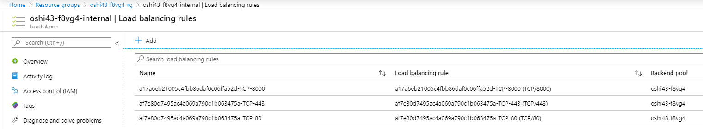
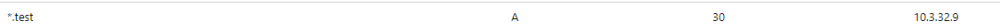

# Egress, Ingress,Route configuration in OPENShift Azure
How to use custom ingress controller, what resources are provisioned on Azure after creating new Ingress/Route, can one Egress handle more namespaces/projects ...

## OCP Network configuration
Cluster base network configuration

primarysubnets:  
master-subnet **10.2.0.0/19**  
worker-subnet **10.2.32.0/19**  
```sh
 # SoftwareNetworkDefinition config
oc get cm sdn-config -o yaml -n openshift-sdn
```
```sh
 # internal cluster networking
oc get network.config cluster -o yaml
```
```sh
 # hostsubnet
oc get hostsubnet

  NAME                                    HOST                                    HOST IP     SUBNET          EGRESS CIDRS   EGRESS IPS
  poshi4-8rlc7-master-0                   poshi4-8rlc7-master-0                   10.2.0.4    10.130.0.0/23
  poshi4-8rlc7-master-1                   poshi4-8rlc7-master-1                   10.2.0.7    10.129.0.0/23
  poshi4-8rlc7-master-2                   poshi4-8rlc7-master-2                   10.2.0.6    10.128.0.0/23
  poshi4-8rlc7-worker-westeurope1-vqbc4   poshi4-8rlc7-worker-westeurope1-vqbc4   10.2.32.4   10.129.2.0/23
  poshi4-8rlc7-worker-westeurope2-hfprt   poshi4-8rlc7-worker-westeurope2-hfprt   10.2.32.6   10.128.2.0/23
  poshi4-8rlc7-worker-westeurope3-p6b8z   poshi4-8rlc7-worker-westeurope3-p6b8z   10.2.32.5   10.131.0.0/23
```
```sh
 #pods in namespace IP and hostIP addresses:
oc get pods -o json|jq -r '.items[]|{podName:.metadata.name,podIP:.status.podIP,hostIP:.status.hostIP}'
```
## Egress 
Egress IP addresses are implemented as additional IP addresses on the primary network interface of the node and must be in the same subnet as the node’s primary IP address.
### Define Egress  
First we need to define a free pool of egress adresses for nodes.  
**Define Egress adresses for NODES:**
```sh
 # define egress CIDR on all worker nodes for Egress automatic allocations
oc patch hostsubnet poshi4-8rlc7-worker-westeurope3-p6b8z --type=merge -p \
    '{"egressCIDRs": ["10.2.32.0/24"]}'
oc patch hostsubnet poshi4-8rlc7-worker-westeurope1-vqbc4 --type=merge -p \
    '{"egressCIDRs": ["10.2.32.0/24"]}'
oc patch hostsubnet poshi4-8rlc7-worker-westeurope2-hfprt --type=merge -p \
    '{"egressCIDRs": ["10.2.32.0/24"]}'
  # to delete
oc patch hostsubnet poshi4-8rlc7-worker-westeurope3-p6b8z --type=merge -p \
    '{"egressCIDRs": null}'

 # single IP assigment
oc patch hostsubnet oshi43-f8vg4-worker-westeurope3-5rv87 --type=merge -p \
  '{ "egressIPs": ["10.3.32.7"]}'
```
**Assign egress adress to namespace:**
```sh
# assign IP address for egress on namespace
oc patch netnamespace blaster --type=merge -p \
    '{"egressIPs": ["10.3.32.17"]}'

 # to delete
oc patch netnamespace blaster --type=merge -p \
    '{"egressIPs": null}'
oc patch netnamespace master --type=merge -p \
    '{"egressIPs": null}'
```

#### Egress IP decomposition, one egress adress for one namespace
for egress create/delete I wrote a small script [addingress.fish](./yaml/deployment/sourceIP_listener/addingress.fish)
```sh
./addingress add
 NAME      NETID      EGRESS IPS
 blaster   13327141   [10.2.32.10]
 NODE                                   EGRESS IPS                  
 poshi4-8rlc7-worker-westeurope3-p6b8z [10.2.32.10]
```
```sh
 #login to node with defined Egress
oc debug node/poshi4-8rlc7-worker-westeurope3-p6b8z

ip a
 eth0: <BROADCAST,MULTICAST,UP,LOWER_UP> mtu 1500 qdisc mq state UP group default qlen 1000
  link/ether 00:0d:3a:ad:7a:a2 brd ff:ff:ff:ff:ff:ff
  inet 10.2.32.5/19 brd 10.2.63.255 scope global noprefixroute eth0
     valid_lft forever preferred_lft forever
  inet 10.2.32.10/19 brd 10.2.63.255 scope global secondary eth0:eip
     valid_lft forever preferred_lft forever
 #egress ip is set as secondary adress for primary interface

ovs-ofctl -O OpenFlow13 dump-flows br0 table=100
  reg0=0xcb5b25 actions=set_field:c6:0b:ec:f2:c0:fe->eth_dst,set_field:0x1cb5b24->pkt_mark
 req0=0xcb5b25 --> to decimal 13327141 (NETID)

iptables -t nat -S POSTROUTING
  -P POSTROUTING ACCEPT
  -A POSTROUTING -m comment --comment "rules for masquerading OpenShift traffic" -j OPENSHIFT-MASQUERADE
  -A POSTROUTING -m comment --comment "kubernetes postrouting rules" -j KUBE-POSTROUTING

iptables -t nat --list|grep -B 2 "10.2.32.10"
  target     prot opt source               destination
  SNAT       all  --  10.128.0.0/14        anywhere             mark match 0x1cb5b24 to:10.2.32.10


./addingress del
```

#### Egress IP decomposition with one Egress IP for two different Namespaces
IP for egress is removed from **hostsubnet** after I created one for second **namespace**.
**So the conclusion is that we cannot use ONE EGRESS IP for two namespaces**

test:
```sh
 # two namespaces: master,blaster
oc patch hostsubnet poshi4-8rlc7-worker-westeurope3-p6b8z --type=merge -p \
    '{"egressCIDRs": ["10.2.32.0/24"]}'
oc patch netnamespace blaster --type=merge -p \
    '{"egressIPs": ["10.2.32.10"]}'
oc get hostsubnets poshi4-8rlc7-worker-westeurope3-p6b8z -o json|jq -c '.egressIPs'
oc patch netnamespace master --type=merge -p \
    '{"egressIPs": ["10.2.32.10"]}'
oc get hostsubnets poshi4-8rlc7-worker-westeurope3-p6b8z -o json|jq -c '.egressIPs'
 >> null
 # node debug
oc debug node/poshi4-8rlc7-worker-westeurope3-p6b8z
iptables -t nat --list|grep "10.2.32.10"
 >> empty
```
##### Conclusion and workaround to enable one egress IP for two namespaces
- pokud je automatické nastavování egressIP na uzlu (podle CIDR), tak odebere danou egressIP z uzlu
- odebere danou sekundární IP adresu ze síťového rozhraní na nodu
- zablokuje komunikaci z NS na úrovni OpevVSwitch (actions=drop)
  cookie=0x0, duration=236.786s, table=100, n_packets=0, n_bytes=0, priority=100,reg0=0xedb1c5 actions=drop
- smaže odpovídající SNAT
 

**workaround:**
```sh
 # nastavení sekundární IP adresy
  ip a add 10.3.32.7/19 dev eth0 broadcast 10.3.63.255 label eth0:eip
```

```sh
 # nastavení SNAT
  iptables -t nat -I OPENSHIFT-MASQUERADE 1 -s 10.128.0.0/14 -m mark --mark 0xd9d8f0 -j SNAT --to-source 10.3.32.7
  iptables -t nat -I OPENSHIFT-MASQUERADE 1 -s 10.128.0.0/14 -m mark --mark 0x1edb1c4 -j SNAT --to-source 10.3.32.7
```

```sh
 # tohle nastaveno taky, ale nemělo by být pro test důležité
  iptables -t filter -A OPENSHIFT-FIREWALL-ALLOW -d 10.3.32.7/32 -m conntrack --ctstate NEW -j REJECT --reject-with icmp-port-unreachable
```

```sh
 # zrušení drop pravidel (resp. všech pravidel pro dané netid v tabulce 100)
  ovs-ofctl -O OpenFlow13 del-flows br0 "reg0=0xd9d8f0"
  ovs-ofctl -O OpenFlow13 del-flows br0 "reg0=0xedb1c5"
```

```sh
 # nastavení označení paketů (pro průchod výše uvedeným SNAT pravidlem) - vzal jsem to dle výpisu, mnoho polí nejspíš není třeba nastavovat
  ovs-ofctl -O OpenFlow13 add-flow br0 "cookie=0x0, duration=9.187s, table=100, n_packets=0, n_bytes=0, priority=100,ip,reg0=0xd9d8f0 actions=set_field:46:d1:e9:2d:fe:e8->eth_dst,set_field:0xd9d8f0->pkt_mark,goto_table:101"
  ovs-ofctl -O OpenFlow13 add-flow br0 "cookie=0x0, duration=52.431s, table=100, n_packets=0, n_bytes=0, priority=100,ip,reg0=0xedb1c5 actions=set_field:46:d1:e9:2d:fe:e8->eth_dst,set_field:0x1edb1c4->pkt_mark,goto_table:101"
```

#### AZURE INFRAstructure limitation
- common problem:
Pokud nadefinuji Egress adresu vytvori se pouze na OCP nodu, nevytvori se na Azure VM a je nutne ji vytvořit ručně. Failover by se taky musel dělat ručně.
- public LB:
When I set an Ingress for namespace, no workload will get out from Cluster. In case no Egress is defined I got sourceIP as a IP adress of LoadBalancer. **Standard LoadBalacer** with public IP has **backend pool with Worker VM and their primary NIC adress** and doing **SNAT(implicitly, can be turned off)**. When I create an Egress new IP is created and such a IP is not in backend pool. 
Test for egress defined with for UDR instead of loadbalancing (SNAT). Nejsem si jist zda bude nutne mit nadefinovanou adresu na azureVM pokud pouzijeme UserDefinedRouting.


For public access with Egress NAT GATEWAY should be used, it is defined against **subnet** but in preview.


## Ingress
- If you have HTTP/HTTPS, use an Ingress Controller.
- If you have a TLS-encrypted protocol other than HTTPS. For example, for TLS with the SNI header, use an Ingress Controller.
- Otherwise, use a Load Balancer, an External IP, or a NodePort.
### INGRESS Controller
+ 1. each workload namespace should have own IPadress(and DNS record) for routes which will access only resources in this namespace.
+ 2. each workload namespace namespace will have own ingress controller.
#### INGRESS Controller Azure Infrastructure facts

```sh
 # default ingress controller
oc get -n openshift-ingress-operator ingresscontrollers default -o yaml

    endpointPublishingStrategy:
        loadBalancer:
              scope: External
        type: LoadBalancerService

oc get  infrastructure.config.openshift.io cluster -o yaml 
  
  apiServerInternalURI: https://api-int.oshi43.sudlice.org:6443
  apiServerURL: https://api.oshi43.sudlice.org:6443
  etcdDiscoveryDomain: oshi43.sudlice.org
  infrastructureName: oshi43-f8vg4
  platform: Azure
  platformStatus:
    azure:
      networkResourceGroupName: oshi_vnet_rg
      resourceGroupName: oshi43-f8vg4-rg
    type: Azure
```
[cloud-provider-azure:cloud-provider-config](https://github.com/kubernetes-sigs/cloud-provider-azure/blob/master/docs/cloud-provider-config.md)
```sh
 # config for Azure cloud 
oc get configmap -n openshift-config cloud-provider-config -o yaml 
```

#### ROUTE SHARDING
In OCP, each route can have any number of labels in its metadata field. A router uses selectors (also known as a selection expression) to select a subset of routes from the entire pool of routes to serve. A selection expression can also involve labels on the route’s namespace. The selected routes form a router shard.
##### IngressController for privateZone
```yaml
 #create internal ingresscontroller
apiVersion: v1
items:
- apiVersion: operator.openshift.io/v1
  kind: IngressController
  metadata:
    name: internal
    namespace: openshift-ingress-operator
  spec:
    domain: test.oshi43.sudlice.org 
    endpointPublishingStrategy:
      loadBalancer:
        scope: Internal
      type: LoadBalancerService
    nodePlacement:
      nodeSelector:
        matchLabels:
          node-role.kubernetes.io/worker: ""
    routeSelector:
      matchLabels:
        type: internal

```
```yaml
 #created service
oc get svc -n openshift-ingress router-internal
NAME              TYPE           CLUSTER-IP     EXTERNAL-IP   PORT(S)                      AGE
router-internal   LoadBalancer   172.30.42.50   10.3.32.9     80:31946/TCP,443:31190/TCP   37m
```
For defining external-IP, namespaceOperator will be used.
 


```yaml
 #create route that fullfill matchLabel
apiVersion: route.openshift.io/v1
kind: Route
metadata:
  labels:
    app: example
    type: internal
    ...
```
Only route with type:internal label will be processed by internal IngressController 
**By default, the default router have not routeSelector, and for this reason is exposed to both routes, also is exposed to the default.**

##### Namespace selector in Route Sharding
Another selectors in the ingresscontrollers are the namespaceSelectors. This selectors, allow that only the routes exposed in that namespaces are served by the routers labeled with this.
```yaml
 #create internal ingresscontroller with namespaceSelector
apiVersion: v1
items:
- apiVersion: operator.openshift.io/v1
  kind: IngressController
  metadata:
    name: internal
    namespace: openshift-ingress-operator
  spec:
    domain: test.oshi43.sudlice.org 
    endpointPublishingStrategy:
      loadBalancer:
        scope: Internal
      type: LoadBalancerService
    nodePlacement:
      nodeSelector:
        matchLabels:
          node-role.kubernetes.io/worker: ""
    routeSelector:
      matchLabels:
        type: internal
    namespaceSelector:
        matchLabels:
          ingressname: test
```
```yaml
 #label namespace
oc label ns test ingressname=test
```
Ingress controller internal will be now used by routes in NS test

## NON-HTTP traffic L4 TCP/UDP
### USE AZURE INTERNAL LOADBALANCER
```yaml
 #service declaration
 # OCP will create azureLB [infrastructureName]-internal with respective rule 
[...]
metadata:
    name: my-service
    annotations:
        service.beta.kubernetes.io/azure-load-balancer-internal: "true"
[...]
```
### USE HA PROXY
!! Not supported by OCP right now!!! but with a little effort who knows
[ha proxy tcp-services-configmap](https://github.com/jcmoraisjr/haproxy-ingress/blob/release-0.8/README.md#tcp-services-configmap)
