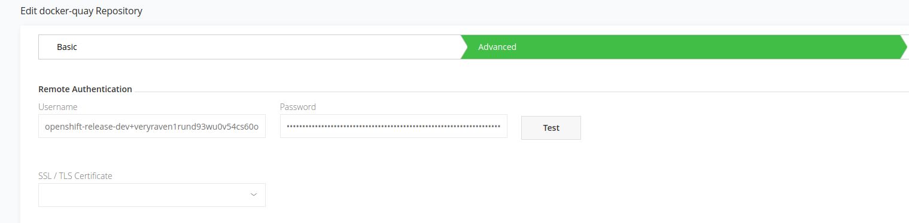

# Purpose DISCLAMER 
For purposes of installing and use OCP in private zone with limited internet access, there is a need to use Artifactory as a source for public container images (QUAI, public containers). In this article we will solve such a problem a move on to installation of OCPv4 in such a environment.  
Artifactory will be installed to older OCP env and a new OCP will be made later with usage of "proxied" containers. 

## 1. Artifactory facts
[Artifactory link](https://artifactory.csas.elostech.cz/ui/login/)  
repository:
+ artifactory.csas.elostech.cz/docker-quay (remote repositoru directed to  **quay.io**)
+ artifactory.csas.elostech.cz/docker-quay-local (local repository for mirroring)

**Trusted TLS cert must be used for docker registry, there is no option to use insecure container repo during install.**

## 2. CREATE PULL SECRET FILE
Content of this file will be put to .pullSecret key in install-config.yaml

```sh
 #create auth
echo -n 'usernametoartifactory:password'|base64 -w0
 # download pull secret file from redhat and add artifactory secret to it
cat pull-secret.json |jq '.auths += {"artifactory.csas.elostech.cz": {"auth": "dXNlcjpxeFloSmcyczQxckpGQXVISk5pMg==","email": "dedtom@gmail.com"}}' >pull-secret2.json
```

## 3. MIRRORING content of ocp-release repository as local repository on Artifactory
Using local repository on **artifactory/docker-quay-local**
```sh
oc -a pull-secret2.json adm release mirror \
    --from=quay.io/openshift-release-dev/ocp-release@sha256:ea7ac3ad42169b39fce07e5e53403a028644810bee9a212e7456074894df40f3 \
    --to=artifactory.csas.elostech.cz/docker-quay-local/ocp-release \
    --to-release-image=artifactory.csas.elostech.cz/docker-quay-local/ocp-release:4.3.1 \
```
To use the new mirrored repository to install, add the following section to the install-config.yaml:

```yaml
imageContentSources:
- mirrors:
  - artifactory.csas.elostech.cz/docker-quay-local/ocp-release
  source: quay.io/openshift-release-dev/ocp-release
- mirrors:
  - artifactory.csas.elostech.cz/docker-quay-local/ocp-release
  source: quay.io/openshift-release-dev/ocp-v4.0-art-dev
```	

```sh
 #extract client openshift-install
oc adm -a pull-secret2.json  release extract --command=openshift-install artifactory.csas.elostech.cz/docker-quay-local/ocp-release@sha256:ea7ac3ad42169b39fce07e5e53403a028644810bee9a212e7456074894df40f3 
```
**don't fotget to put cert into install-config.yaml**
```yaml
additionalTrustBundle: |
  -----BEGIN CERTIFICATE-----
  . . . 
  -----END CERTIFICATE-----
```
**In this case installation works fine and custom repo is used** 
install-config.yaml](yaml/artifactory-as-containerproxy/install-config_mirror.yaml)  
```sh
./openshift-install create cluster --log-level debug --dir ./install
```
### CHECK bootstrap machine if registries are working 
*Only fact check.*
```sh
 # use id_rsa  key used during installation 
ssh core@bootSTRAPmachineIP

cat /etc/containers/registries.conf
[[registry]]
location = "quay.io/openshift-release-dev/ocp-release"
insecure = false
mirror-by-digest-only = true

[[registry.mirror]]
location = "artifactory.csas.elostech.cz/docker-quay-local/ocp-release"
insecure = false

[[registry]]
location = "quay.io/openshift-release-dev/ocp-v4.0-art-dev"
insecure = false
mirror-by-digest-only = true

[[registry.mirror]]
location = "artifactory.csas.elostech.cz/docker-quay-local/ocp-release"
insecure = false
```
The first working mirror is used to supply the pulled image.  
The main registry will only be used if no other mirror works.  
From the system context, the Insecure flags are used as fallback.  

## 4. USING REMOTE repository on Artifactory for installation
In this case we will use **remote repository** configured on **Artifactory**

```sh
oc adm release info --image-for=machine-os-content quay.io/openshift-release-dev/ocp-release@sha256:ea7ac3ad42169b39fce07e5e53403a028644810bee9a212e7456074894df40f3                                                                                                                     
 > quay.io/openshift-release-dev/ocp-v4.0-art-dev@sha256:be4802b6fe6343053d9f5668acecd68dfb38c4be364a9a3c06e818d56ed61ad1
 # decode quay.io pull secret:
cat pull-secret2.json|jq -r '.auths."quay.io".auth'|base64 -d
 > openshift-release-dev+veryraven1rund93wu0v54cs60osj6x1sk5i:Z56AAT002OIGKV9OJVTKP8T3G357329ECKAUX0LBRHIGUGJ4H3UGOLHSIJPNHK4N
 # it is a robot login
docker login -u firstpart -p secondpart quay.io
 # test it
docker pull quay.io/openshift-release-dev/ocp-v4.0-art-dev@sha256:8a752dfed8c27a60d13f3dc578a1ea15efb2800041810204dd7b3bb79eedee04
```

add this part to install-config.yaml

```yaml
imageContentSources:
- mirrors:
  - artifactory.csas.elostech.cz/docker-quay/openshift-release-dev/ocp-release
  source: quay.io/openshift-release-dev/ocp-release
- mirrors:
  - artifactory.csas.elostech.cz/docker-quay/openshift-release-dev/ocp-v4.0-art-dev
  source: quay.io/openshift-release-dev/ocp-v4.0-art-dev
```

**On artifactory UI page go to Remote registry, enable Token Authentication and in Advanced tab--> Remote Authentication add
username and password from**
```sh
 cat pull-secret2.json|jq -r '.auths."quay.io".auth'|base64 -d
```

and test it
```sh
docker pull artifactory.csas.elostech.cz/docker-quay/openshift-release-dev/ocp-v4.0-art-dev@sha256:8a752dfed8c27a60d13f3dc578a1ea15efb2800041810204dd7b3bb79eedee04
```
install:
copy [install-config.yaml](yaml/artifactory-as-containerproxy/install-config.yaml) to ./install dir and run
```sh
./openshift-install create cluster --log-level debug --dir ./install
```

## 5. USING Artifactory REPOSITORY for upgrade
### Mirrored local repository
To use the new mirrored repository for upgrades, use the following to create an ImageContentSourcePolicy:
```yaml
apiVersion: operator.openshift.io/v1alpha1
kind: ImageContentSourcePolicy
metadata:
  name: mirror
spec:
  repositoryDigestMirrors:
  - mirrors:
    - artifactory.csas.elostech.cz/docker-quay-local/ocp-release
    source: quay.io/openshift-release-dev/ocp-release
  - mirrors:
    - artifactory.csas.elostech.cz/docker-quay-local/ocp-release
    source: quay.io/openshift-release-dev/ocp-v4.0-art-dev
```
### Remote repository
```yaml
apiVersion: operator.openshift.io/v1alpha1
kind: ImageContentSourcePolicy
metadata:
  name: proxy
spec:
  repositoryDigestMirrors:
  - mirrors:
    - artifactory.csas.elostech.cz/docker-quay/openshift-release-dev/ocp-release
    source: quay.io/openshift-release-dev/ocp-release
  - mirrors:
    - artifactory.csas.elostech.cz/docker-quay/openshift-release-dev/ocp-v4.0-art-dev
    source: quay.io/openshift-release-dev/ocp-v4.0-art-dev
					
```

## Change repository adress and pullsecrets on running cluster
How to change a repository values on running cluster (adress of artifactory has changed).
Content of .pullSecret is stored in **MachineConfig** and as a secret in 
```sh
oc get machineconfig 00-master -o yaml|grep artifactory -A4
oc get machineconfig 00-worker -o yaml|grep artifactory -A4
 # nebo si vsechny hodnoty muzeme vytahnout z renderconfigu
```
Machineconfig odkazuje na soubor **/var/lib/kubelet/config.json**  ktery obsahuje pull secrety pro container registry. Neni potreba ho menit prez machineconfig ale pokud upravime
**secret openshift-config/pull-secret** tak se jeho hodnoty propisi sem (neprisel jsem na to jak zjistit vazbu, zjisteno experimentalne) 

```sh
oc get secret -n openshift-config pull-secret -o json |jq -r '.data[]'|base64 -d
 # a pridani hodnot pro novou artifactory repository
 echo -n 'username:password'|base64 -w0
 # pridani nove hodnoty do stavajicich pull-secretu
 oc get secret -n openshift-config pull-secret -o json |jq -r '.data[]'|base64 -d|jq '.auths += {"artifactory.csas.elostech.cz":{"auth":"b2NwOlRyZTVaaXpxbEdKT1NZdzhCUVZ5ZGFXbjk0eVZNZg==","email":"dedtom@gmail.com"}}' >pull-secret.json
 oc set data secret/pull-secret -n openshift-config --from-file=.dockerconfigjson=pull-secret.json
 # dojde k postupnemu restartu vsech nodu
```
Zbyva jeste upravit zaznam v machineconfigu pro **/etc/containers/registries.conf**
Tento soubor je castecne definovan z  **crd imageContentSourcepolicy** takze staci provest edit nad souborem, pockat na restart nodu a je hotovo.
```sh
oc get imageContentSourcepolicy
```
## Problem with registries.conf append
Soubor **/etc/containers/registries.conf** plnen operatorem z CRD imageContentSourcepolicy(vezme vsechny NAME a conctatne je do jednoho souboru) jako Machineconfig
```sh
oc get machineconfig|grep registries
 > 99-master-c8f3919a-ee7b-4c98-a1f7-96f7bdbb3747-registries   
 > 99-worker-72f09b45-8b75-4609-9071-b2c50143f309-registries

oc get imeagecontentsourcepolicy
```
```sh
 # zkraceno
oc get machineconfig 99-master-c8f3919a-ee7b-4c98-a1f7-96f7bdbb3747-registries -o yaml

  apiVersion: machineconfiguration.openshift.io/v1
  kind: MachineConfig
  metadata:
    annotations:
      machineconfiguration.openshift.io/generated-by-controller-version: 8af4f709c4ba9c0afff3408ecc99c8fce61dd314
    labels:
      machineconfiguration.openshift.io/role: master
    name: 99-master-c8f3919a-ee7b-4c98-a1f7-96f7bdbb3747-registries
    ownerReferences: #dulezite
    - apiVersion: config.openshift.io/v1
      kind: Image
      name: cluster
      uid: e6cda66f-ba77-4248-9123-f55f32a19f9b

 
 # na filesystemu Nodu je pak prezentovan jako
 # cat /etc/containers/registries.conf

unqualified-search-registries = ["registry.access.redhat.com", "docker.io"]

[[registry]]
  prefix = ""
  location = "quay.io/openshift-release-dev/ocp-release"
  mirror-by-digest-only = true

  [[registry.mirror]]
    location = "artifactory.csas.elostech.cz/docker-quay/openshift-release-dev/ocp-release"
```
Abychom mohli delat presmerovani potrebujeme dostat do souboru hodnoty,
```sh
[[registry]]
prefix = "presmerovani_repozitare"
location = "pozadovany_repozitar"
```
ImageContentSourcePolicy vsak toto neumi
```sh
oc explain Imagecontentsourcepolicy --recursive
```

Coz by slo vyresit prez dalsi machineconfig ktery by udelal **ignition append** do souboru. V OCP je vsak coreOS ignition **append** zakazan.

Reseni by mohlo byt pouziti registry.mirror pro vsechny potrebne registry, pokud by ale nebylo presmerovane registry dostupne, provede se fallback na puvodni (blokovane na sitove urovni).

**!HAPPY GUNNING!**
